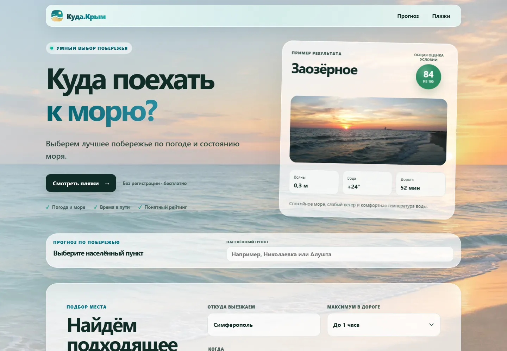

# Куда.Крым

[](https://github.com/Aleks-man/kuda-krym/actions/workflows/ci.yml)

**Куда поехать к морю, если важны погода, волны и время в дороге?**

Куда.Крым — pet-проект для выбора пляжа на побережье Крыма. Пользователь указывает
точку выезда, день, время поездки и приоритет: спокойное море, тёплая вода или
комфортная погода. Сервис сравнивает доступные варианты и предлагает подходящие пляжи.

**[Открыть сайт → kudakrym.ru](https://kudakrym.ru)** ·
[Документация](docs/README.md) ·
[Как рассчитывается рейтинг](docs/domain/recommendation-ranking.md)

[](https://kudakrym.ru)

## Что можно попробовать

- Выбрать место в каталоге из **50 пляжей и 36 прибрежных локаций**:
  поиск, фильтры по региону и населённому пункту, интерактивные Яндекс Карты.
- Открыть прогноз на три дня: температура воздуха и воды, ветер, порывы, волны
  и осадки. В верхней карточке — температура «по ощущениям», влажность и УФ-индекс, атмосферное давление и видимость.
- Подобрать пляж по точке выезда, допустимому времени в пути и предпочтениям.
- Сравнить выбранные пляжи и посмотреть автомобильный маршрут.
- Посмотреть согласованность погодных моделей и время обновления данных.
- Открыть отдельный прогноз для Симферополя без морских показателей.

Интерфейс адаптирован для экранов от 320 px. У фотографий указаны источники,
авторы и лицензии; снимок района не выдаётся за фотографию конкретного пляжа.

## Как это устроено

**Рекомендации.** API объединяет почасовые данные погоды и моря, оценивает условия
в выбранном временном окне и учитывает приоритет пользователя. Время в дороге
ограничивает выбор кандидатов. Погодные и морские оценки рассчитываются по
[явным формулам](docs/domain/conditions-scoring.md), а неполные данные снижают
уверенность в результате. Отсутствующее значение не подменяется нулём.

**Внешние сервисы.** Open-Meteo поставляет прогноз погоды и моря, OSRM —
автомобильные маршруты, Photon — поиск населённых пунктов для точки выезда.
Карты отображаются через JavaScript API Яндекса.

**Отказы и кеширование.** Redis хранит прогнозы и маршруты; одинаковые параллельные
запросы объединяются. При недоступности погодного источника API может вернуть
сохранённый прогноз с отметкой об устаревании. Интерфейс предупреждает об этом.

**Производительность.** Перед запуском и сборкой Sharp подготавливает несколько
размеров фотографий. Браузер получает подходящий размер через `srcset`.
Размер JS и CSS контролируется бюджетом сборки; планшетные сценарии проверяются
в Chromium и WebKit. [Подробности оптимизации](docs/development/web-performance.md).

## Стек и структура

TypeScript · Next.js 16 · React 19 · Express 5 · Zod · PostgreSQL · Prisma · Redis

| Каталог | Назначение |
| --- | --- |
| `apps/web` | Интерфейс на Next.js |
| `apps/api` | API: прогнозы, маршруты, рекомендации и каталоги |
| `packages/contracts` | Общие схемы Zod и типы запросов и ответов |
| `packages/database` | Prisma, миграции, seed и клиент PostgreSQL |
| `packages/config` | Общие настройки инструментов |
| `tests/e2e` | Браузерные сценарии Playwright |
| `docs` | Формулы, предметная область и эксплуатация |

Тестирование: Vitest, Supertest, Playwright и axe. Развёртывание: Docker Compose;
CI проверяет код, браузерные сценарии, контейнерные сборки и зависимости.

## Локальный запуск

Нужны Node.js **20.19+**, npm **10+** и работающий PostgreSQL.
Redis рекомендуется для кеширования; API умеет работать без него.
Команды ниже приведены для PowerShell и выполняются из корня репозитория.

```powershell
git clone https://github.com/Aleks-man/kuda-krym.git
cd kuda-krym
npm ci

Copy-Item packages/database/.env.example packages/database/.env
Copy-Item apps/api/.env.example apps/api/.env
Copy-Item apps/web/.env.example apps/web/.env.local
```

Создайте в PostgreSQL базу `kuda_krym` и укажите её адрес и учётные данные
в файлах `packages/database/.env` и `apps/api/.env`.
Если используется `DIRECT_URL`, обновите его тоже: миграции и seed предпочитают
его значению `DATABASE_URL`. Для локальной базы оба адреса могут совпадать.

В `apps/web/.env.local` задайте ключ `NEXT_PUBLIC_YANDEX_MAPS_API_KEY` для карт,
разрешив в настройках ключа локальный домен. Для запуска с Redis проверьте
`REDIS_URL` в `apps/api/.env`.

Сгенерируйте Prisma Client, соберите пакет базы, примените существующие миграции
и загрузите начальный каталог в созданную локальную базу:

```powershell
npm run build --workspace @kuda-krym/database
npm run database:migrate
npm run seed --workspace @kuda-krym/database
npm run dev
```

Сайт: **http://localhost:3000**. API: **http://localhost:4000**.
Повторять seed при каждом запуске не нужно.

Контейнерный запуск и переменные окружения описаны в
[руководстве по эксплуатации](docs/reference/operations.md).
Для публикации на VPS есть [отдельная инструкция](infra/vps/README.md).

## Проверки

```powershell
npm run check
```

Проверяет seed и изображения, типы, ESLint, тесты Vitest и служебные тесты,
production-сборку и бюджет JS/CSS. Браузерные тесты и аудит зависимостей
запускаются отдельно:

```powershell
npm run test:e2e:install
npm run test:e2e
npm run audit:security
```

E2E требуют отдельную PostgreSQL-базу `kuda_krym_e2e`.
По умолчанию используется `postgres:postgres@127.0.0.1:5432`;
другое подключение задаётся через `E2E_DATABASE_URL`. Имя базы обязано
заканчиваться на `_e2e`: тесты применяют миграции и загружают тестовый каталог.
Команда установки браузеров подготавливает **Chromium и WebKit**.
[Подробности E2E](tests/e2e/README.md).

GitHub Actions запускает проверки при push в `main`, pull request в `main`,
по недельному расписанию и вручную. Автоматические проверки доступности
помогают находить ошибки, но не заменяют ручную проверку интерфейса.

## Данные и ограничения

В каталоге — 47 исходных WebP-фотографий; у всех 36 прибрежных локаций есть
обложки, у 15 пляжей — собственные подтверждённые фотографии.
Для остальных используются явно обозначенные фотографии побережья.
[Источники и лицензии](docs/reference/operations.md#фотографии-и-лицензии).

Погодный прогноз и рейтинг помогают сравнивать условия. Они не подтверждают
открытие пляжа, качество воды или безопасность купания. Работа прогноза,
геопоиска и маршрутов зависит от доступности внешних сервисов.

## Автор

**Alexandr Manuylov** · [Telegram](https://t.me/Aleks_Manuilov) ·
[Почта](mailto:manuylov_aleks@icloud.com)
